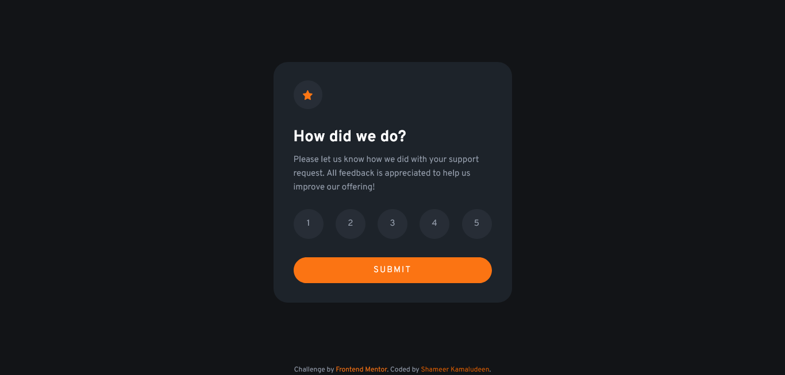

# Frontend Mentor - Interactive rating component solution

This is a solution to the [Interactive rating component challenge on Frontend Mentor](https://www.frontendmentor.io/challenges/interactive-rating-component-koxpeBUmI). Frontend Mentor challenges help you improve your coding skills by building realistic projects. 

## Table of contents

- [Overview](#overview)
  - [The challenge](#the-challenge)
  - [Screenshot](#screenshot)
  - [Links](#links)
- [My process](#my-process)
  - [Built with](#built-with)
  - [What I learned](#what-i-learned)
  - [Useful resources](#useful-resources)
- [Author](#author)

## Overview
This project I considered as a learning process for a lot of things which I have learned recently like SCSS, modular approach to web design, following sass guidelines and a few others. This project was nice to experiment with my learnings as the project is a very simple block and I am able to focus on the guidelines, modularity and architecture of web development.

### The challenge

Users should be able to:

- View the optimal layout for the app depending on their device's screen size
- See hover states for all interactive elements on the page
- Select and submit a number rating
- See the "Thank you" card state after submitting a rating

### Screenshot

### Links

- Solution URL: [Click here](https://github.com/shameerkamaludeen/interactive-rating-component)
- Live Site URL: [Click here](https://shameerkamaludeen.github.io/interactive-rating-component/)

## My process

### Built with

- Semantic HTML5 markup
- CSS custom properties
- Flexbox
- Mobile-first workflow
- Sasss
- BEM
- SMACSS

### What I learned

- How to organise Sass files

### Useful resources

- [Sass Guidelines](https://sass-guidelin.es/)
- [Scalable and Modular Architecture for CSS](http://smacss.com/)
- [BEM — Block Element Modifier](http://getbem.com/)
- [BEM](https://en.bem.info/)

## Author

- Github - [Shameer Kamaludeen](https://github.com/shameerkamaludeen)
- Frontend Mentor - [@shameerkamaludeen](https://www.frontendmentor.io/profile/shameerkamaludeen)